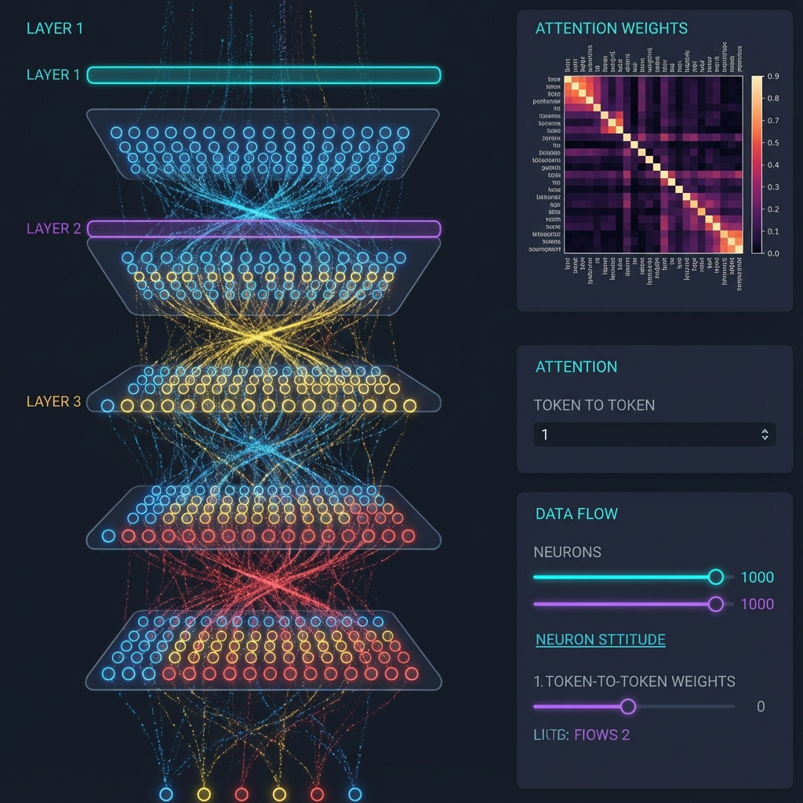

# Phase 4: Activation Tracing & Visualization Architecture

> **Status**: Planning (v2 - with GPT-5.2 feedback)  
> **Vision**: "Brain MRI" for neural networks - see activations flow through layers in real-time  
> **Target**: [karpathy/nanochat](https://github.com/karpathy/nanochat)

---

## Goals

1. **Timeline Capture**: Record activations per decode step with replay
2. **MRI-like Visualization**: Glowing neurons, heatmaps, particle flow
3. **Replay Controls**: Step-based scrubbing (not wall-clock)
4. **Layer Clustering**: Group neurons by activation patterns
5. **Query Comparison**: Compare similar prompts, show activation diffs
6. **Progressive Education**: Perceptron → MLP → Transformer

---

## Architecture Overview

```
┌─────────────────────────────────────────────────────────────────┐
│                     ACTIVATION TRACING PIPELINE                  │
├─────────────────────────────────────────────────────────────────┤
│                                                                  │
│  ┌──────────────┐    ┌──────────────┐    ┌──────────────────┐   │
│  │  Model Hooks │───▶│ TraceBuffer  │───▶│  Chunk Storage   │   │
│  │  (forward)   │    │  (ring buf)  │    │  (IndexedDB)     │   │
│  └──────────────┘    └──────────────┘    └──────────────────┘   │
│         │                    │                                   │
│         │                    ▼                                   │
│         │          ┌──────────────────┐                         │
│         └─────────▶│  WebSocket Push  │ ──▶ Real-time viz       │
│                    │  (binary frames) │                         │
│                    └──────────────────┘                         │
└─────────────────────────────────────────────────────────────────┘
```

---

## Critical Design Decisions (from GPT-5.2 review)

### 1. Time Axis = Step, Not Wall-Clock

```typescript
// ❌ Old (problematic)
timestamp: number;  // ms since trace start - noisy, non-deterministic

// ✅ New (step-based)
phase: 'prefill' | 'decode';
step: number;       // decode step index (0, 1, 2...)
pos0: number;       // absolute sequence position (KV cache position)
t_add: number;      // tokens processed this call (often 1 in decode)
```

**Why**: Replay should map to "token N, layer L" - independent of machine speed.

### 2. Typed Payloads (not one-size-fits-all)

```typescript
type TracePayload =
  | { kind: 'layer_stats'; stats: Stats }
  | { kind: 'topk_hidden'; k: number; indices: Uint32Array; values: Float32Array }
  | { kind: 'sampled_hidden'; stride: number; values: Float32Array }
  | { kind: 'attention_summary'; head: number; topk_keys: Uint16Array; weights: Float16Array; entropy: number }
  | { kind: 'topk_logits'; k: number; tokenIds: Uint32Array; logits: Float32Array };
```

**Why**: Attention is fundamentally different from hidden states - different fast paths.

### 3. TraceConfig (First-Class Budget Control)

```typescript
interface TraceConfig {
  captureMode: 'stats' | 'sampled' | 'topk' | 'full';
  sampleStride: number;           // e.g., every 8th neuron
  topk: number;                   // e.g., 128 per layer per token
  quantization: 'f32' | 'f16' | 'q8';
  maxBytesPerStep: number;
  dropPolicy: 'drop_payload_keep_stats' | 'drop_layer' | 'stop_trace';
  attentionTier: 'summary' | 'full_row' | 'full_matrix';
}
```

**Why**: Without this, you melt performance or can't load traces.

### 4. Chunked Storage (not growing arrays)

```
TraceSession (metadata record)
├── TraceChunk[step=0] (all layer events for step 0, compressed blob)
├── TraceChunk[step=1]
├── TraceChunk[step=2]
└── ...
```

**Key**: `(sessionId, step)` as chunk key → "give me step 42 instantly" without scanning.

**Encoding**: MessagePack + gzip (easy) or FlatBuffers + zstd (optimal).

---

## Revised Data Schema

### TraceEvent (small, indexable)

```typescript
interface TraceEvent {
  id: string;
  sessionId: string;
  
  // Step-based time axis
  phase: 'prefill' | 'decode';
  step: number;
  pos0: number;
  t_add: number;
  
  // Layer identification
  layerKey: string;       // "blocks.07.attn.out"
  layerIndex: number;
  layerType: 'embed' | 'attn' | 'mlp' | 'resid' | 'norm' | 'logits';
  
  // Always captured
  shape: number[];
  stats: {
    mean: number;
    std: number;
    min: number;
    max: number;
    l2: number;
    sparsity?: number;
    p99?: number;
  };
  
  // Optional payload (lazy-loaded from chunk)
  payload?: {
    chunkId: string;
    offset: number;
    length: number;
    encoding: 'f32' | 'f16' | 'q8';
    compression: 'none' | 'lz4' | 'zstd';
    sample: { kind: 'stride' | 'topk' | 'rand'; param: number };
  };
}
```

### TraceSession (metadata)

```typescript
interface TraceSession {
  id: string;
  prompt: string;
  response: string;
  modelId: string;
  modelConfigHash: string;
  
  traceConfig: TraceConfig;
  
  startTime: Date;
  duration: number;
  
  // Pre-computed for UI
  layers: Array<{ name: string; index: number; type: string; shape: number[] }>;
  tokenStrings: string[];
  tokenIds: number[];
  
  // Chunk index
  chunkCount: number;
}
```

---

## Nanochat Capture Map

Based on nanochat's architecture: `tok_emb + pos_emb → [Block]*N → ln_f → lm_head`  
Each Block: `ln1 → attn → resid, then ln2 → mlp → resid`

### Prefill Policy (prompt processing)
- **Stats only** for all layers (cheap)
- **Optional**: topk_hidden for positions `[0, mid, last]` at resid_post

### Decode Policy (token generation)
- **Stats** for every layer
- **topk_hidden** for last token at key points
- **attention_summary** for last token row per head

### Hook Points per Block

| Layer Key | What | Payload (decode) |
|-----------|------|------------------|
| `embed.resid0` | tok_emb + pos_emb | stats + topk |
| `block.{i}.resid_pre` | input to block | stats + topk |
| `block.{i}.ln1` | after ln1 | stats only |
| `block.{i}.attn_out` | attention projection | stats + topk |
| `block.{i}.attn_summary` | softmax weights | attention_summary |
| `block.{i}.resid_mid` | x + attn_out | stats + topk |
| `block.{i}.ln2` | after ln2 | stats only |
| `block.{i}.mlp_pre` | c_fc output (pre-GELU) | stats |
| `block.{i}.mlp_act` | after GELU | stats (edu mode: topk) |
| `block.{i}.mlp_out` | c_proj output | stats + topk |
| `block.{i}.resid_post` | x + mlp_out | stats + topk |
| `final.ln_f` | final layer norm | stats + topk |
| `final.logits` | lm_head output | stats + topk_logits(20) |

### Attention Summary (avoid full matrix)

Full attention is `[heads, S, S]` - explodes quickly.

For decode step, capture **last query row only**: `att[:, :, -1, :]` → `[B, heads, S]`

Per head:
- topk key positions + weights (k=8)
- entropy
- max_weight
- argmax_keypos

---

## Implementation Phases

### Phase 4.1: Tracer Core
- [ ] TraceCollector class (passed through forward)
- [ ] Module hooks for supported layers
- [ ] Inline tracepoints for functional ops (RMSNorm, RoPE)
- [ ] Attention summary extraction after softmax
- [ ] Ring buffer with drop policy

### Phase 4.2: Transport & Storage
- [ ] WebSocket binary frames (not JSON)
- [ ] Backpressure / rate limiting
- [ ] Chunked IndexedDB storage
- [ ] Chunk compression (MessagePack + gzip)

### Phase 4.3: Timeline Viewer
- [ ] Step-based scrubber
- [ ] Layer list with stats bars
- [ ] Play/pause/speed controls
- [ ] Prefetch chunks around current step

### Phase 4.4: Layer Visualization
- [ ] Glowing neuron grid (topk as bright dots)
- [ ] Stats overlay (mean/std bars)
- [ ] Click neuron → sparkline over time
- [ ] Attention row heatmap

### Phase 4.5: Comparison View
- [ ] Load two sessions
- [ ] Align by shared prefix tokens
- [ ] Diff highlighting (neurons that differed)
- [ ] Pooled similarity score

### Phase 4.6: Education Mode
- [ ] Curated TraceSessions as "lessons"
- [ ] Guided overlays / tooltips
- [ ] Locked controls for progressive reveal
- [ ] Level 1-6 from perceptron to transformer

---

## Recommended Defaults (TraceConfig)

```typescript
const defaultConfig: TraceConfig = {
  captureMode: 'topk',
  sampleStride: 8,
  topk: 128,              // for H=768; use 64 for H<=384
  quantization: 'f16',
  maxBytesPerStep: 50_000,
  dropPolicy: 'drop_payload_keep_stats',
  attentionTier: 'summary',
};
```

---

## Query Comparison Alignment

Two prompts rarely have same tokenization or length. Strategies:

| Strategy | Use Case |
|----------|----------|
| Shared prefix | Compare only prompt tokens both have |
| Token mapping | Match exact tokens that appear in both |
| Pooled repr | Mean over positions → cosine similarity |

**Start with**: Shared prefix (simplest, most robust).

---

## Visualization Concepts

### 1. Glowing Neuron Grid
- Size: proportional to activation magnitude
- Color: temperature scale (blue → white → yellow → red)
- Glow: CSS/WebGL bloom for high activations
- Animation: pulse on activation

### 2. Attention Heatmap (row only)
- Show last query token attending to all keys
- Per-head tabs or multi-head overlay
- Hover for exact weights

### 3. Layer Flow (particles)
- Animated dots flowing between layers
- Speed = activation strength
- Color = temperature scale

### 4. Token Saliency
- Highlight input tokens by influence
- Gradient background intensity
- Arrows to output

---

## Visualization Mockup



---

## MVP Definition (Phase 4.1-4.4)

**Finish line**:

1. ✅ Trace nanochat with stats + top-k per layer per token-step
2. ✅ Store as chunked blobs in IndexedDB
3. ✅ Viewer supports:
   - Token-step scrubber
   - Layer list with stats
   - Per-layer heatmap (top-k as dots + stats overlay)
   - Click neuron → activation-over-time sparkline

That already delivers "MRI" without drowning in data.

---

## Nanochat Integration Notes

**Engine boundary**: Each `model.forward(..., kv_cache=...)` = one "step"

**Attention trap**: If using SDPA/Flash, attention matrices aren't returned without changing compute path. Use summary tier by default.

**Functional ops**: RMSNorm via `F.rms_norm` won't trigger module hooks. Need inline tracepoints.

---

## File Layout (proposed)

```
nanochat-alts/
├── scripts/
│   ├── bridge.py           # existing
│   └── tracer/
│       ├── __init__.py
│       ├── collector.py    # TraceCollector class
│       ├── hooks.py        # register_trace_hooks()
│       ├── buffer.py       # RingBuffer with drop policy
│       ├── transport.py    # WebSocket binary sender
│       └── config.py       # TraceConfig defaults
├── docs/
│   └── viewer/
│       └── src/
│           └── components/
│               ├── ActivationViewer.jsx     # main container
│               ├── TimelineScrubber.jsx     # step navigation
│               ├── LayerList.jsx            # layer selection
│               ├── NeuronGrid.jsx           # glowing dots
│               ├── AttentionHeatmap.jsx     # attention viz
│               └── NeuronSparkline.jsx      # per-neuron time series
```
